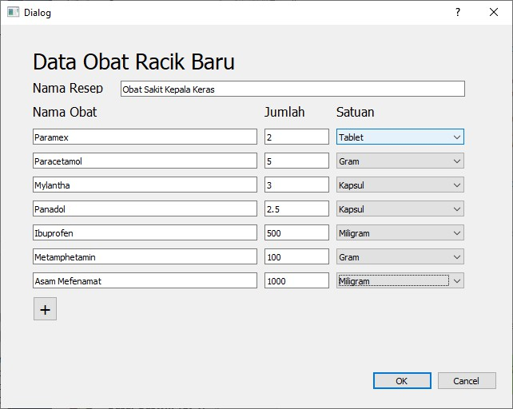
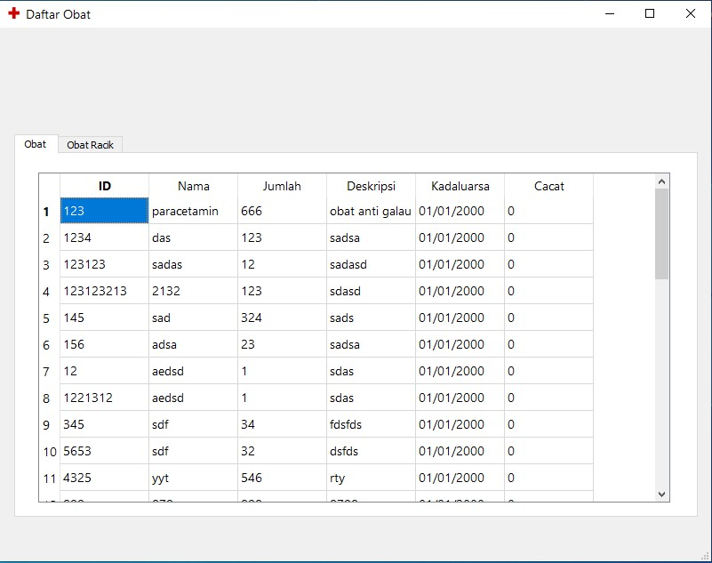
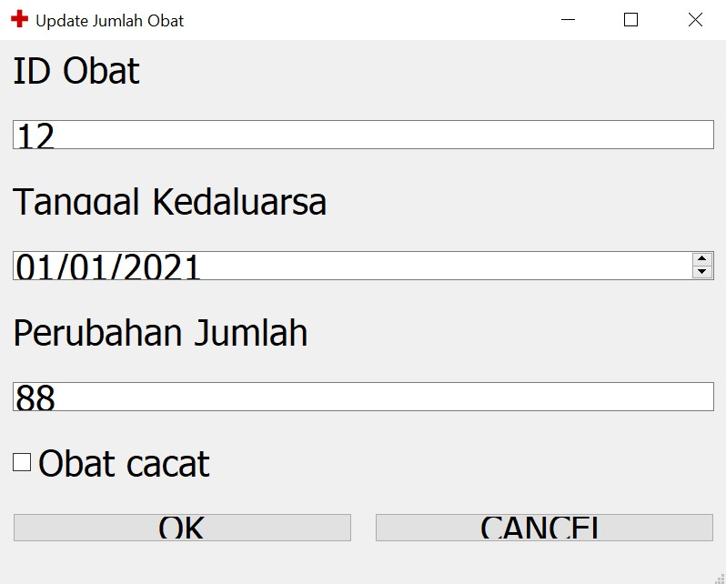
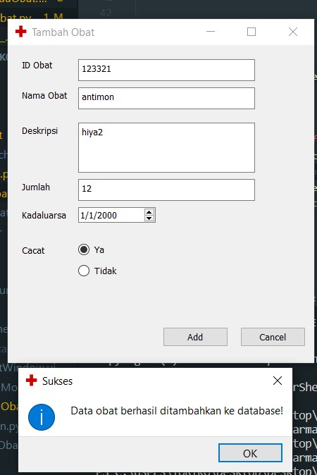

# IF2250-2020-K02-3-Smart Pharmacy
## Implementasi aplikasi Smart Pharmacy

Daftar realisasi modul - Penanggungjawab - NIM: 

<ul>
    <li>Tambah Data Obat Racik Baru - Arung Agamani Budi Putera - 13518005 </li>
    <li>Tampilkan Jumlah Obat - Farras Mohammad Hibban Faddila - 13518017 </li>
    <li>Update Jumlah Obat - Muhammad Kamal Shafi - 13518113 </li>
    <li>Penambahan Obat Baru - Naufal Prima Yoriko - 13518146 </li>
</ul>

# *Capture* Layar
## Modul: Tambah Data Obat Racik Baru

## Modul: Tampilkan Jumlah Obat

## Modul: Update Jumlah Obat

## Modul: Penambahan Obat Baru

# Daftar Realisasi Tabel Basis Data
<ul>
    <li>Obat.db merealisasikan 
    Obat = (ID, Nama, Jumlah, Deskripsi, Kadaluarsa, Cacat)</li>
    <li>Obat.db merealisasikan
    ObatRacik = (IDObatRacik, nama, deskripsi)</li>
    <li>Obat.db merealisasikan
    BahanObatRacik = (IDObatRacik, nama, jujmlah, satuan)</li>
</ul>
